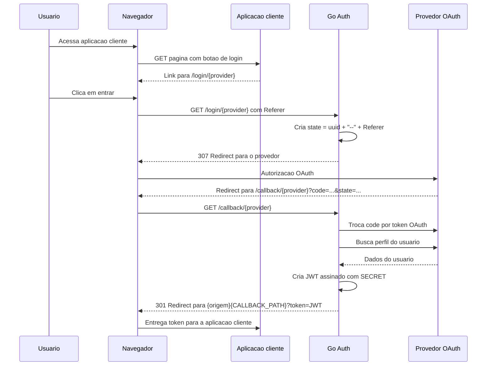
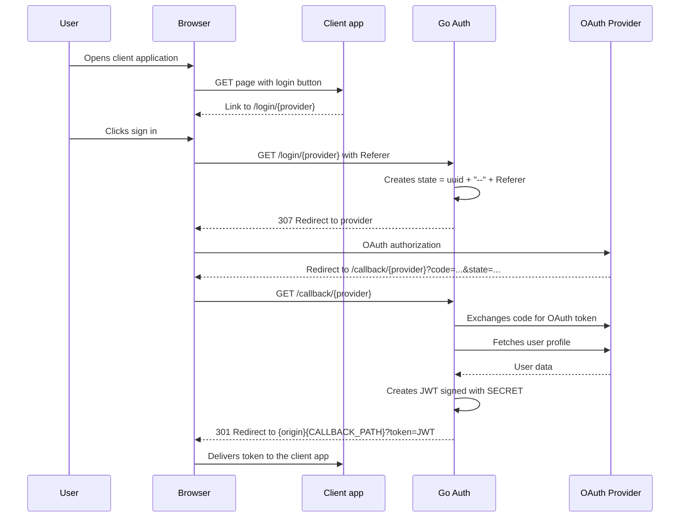

# Go Auth

Servidor Go simples para autenticação OAuth 2.0 com múltiplos provedores. Ele redireciona o usuário para o provedor escolhido, recebe o callback, busca dados básicos do perfil e devolve um JWT assinado para a aplicação cliente.

Simple Go server for OAuth 2.0 authentication with multiple providers. It redirects the user to the selected provider, receives the callback, fetches basic profile data, and returns a signed JWT to the client application.

## Português

### Visão Geral

O projeto expõe rotas HTTP para iniciar e finalizar autenticação OAuth:

- `GET /login/google`
- `GET /login/github`
- `GET /callback/google`
- `GET /callback/github`

Após o callback do provedor, o servidor cria um JWT com informações do usuário e redireciona o navegador para a origem da aplicação cliente usando `CALLBACK_PATH`:

```text
{origem-da-aplicacao-cliente}{CALLBACK_PATH}?token=<jwt>
```

Exemplo:

```text
http://localhost:3000/auth/callback?token=<jwt>
```

### Provedores

| Provedor | Uso | Habilitação | Callback OAuth |
| --- | --- | --- | --- |
| Google | Login com conta Google usando OpenID Connect `userinfo`. | `GOOGLE_ENABLE=1` | `/callback/google` |
| GitHub | Login com conta GitHub usando a API `/user`. | `GITHUB_ENABLE=1` | `/callback/github` |
| Mock | Implementação interna para testes automatizados. | Usado diretamente nos testes | Não usa provedor externo |

Observações importantes:

- Pelo menos um provedor real precisa estar habilitado com `GOOGLE_ENABLE=1` ou `GITHUB_ENABLE=1`.
- As rotas de Google e GitHub sempre existem, mas só funcionam corretamente quando o provedor correspondente está configurado.
- A página `/home` mostra botões para Google e GitHub. Se apenas um provedor estiver configurado, use o botão ou a rota desse provedor.
- O GitHub pode retornar `email` vazio quando o e-mail do usuário não é público. Para suportar e-mails privados, o projeto precisa solicitar o escopo `user:email` e consultar o endpoint de e-mails do GitHub.

### Requisitos

- Go `1.25.0`, conforme definido em [go.mod](go.mod).
- Uma aplicação OAuth configurada no Google, no GitHub ou em ambos.
- Uma aplicação cliente que receba o JWT no caminho definido em `CALLBACK_PATH`.

### Variáveis de Ambiente

O projeto usa `github.com/joho/godotenv/autoload`, então um arquivo `.env` na raiz é carregado automaticamente em desenvolvimento local.

Variáveis gerais:

| Variável | Obrigatória | Exemplo | Descrição |
| --- | --- | --- | --- |
| `PORT` | Sim | `5000` | Porta do servidor HTTP. |
| `CALLBACK_PATH` | Sim | `/auth/callback` | Caminho da aplicação cliente para onde o servidor redireciona com o JWT. |
| `SECRET` | Sim | `troque-por-uma-chave-forte` | Chave usada para assinar o JWT com HS256. |
| `GOOGLE_ENABLE` | Sim | `1` ou `0` | Habilita (`1`) ou desabilita (`0`) o provedor Google. |
| `GITHUB_ENABLE` | Sim | `1` ou `0` | Habilita (`1`) ou desabilita (`0`) o provedor GitHub. |

Variáveis do Google, obrigatórias quando `GOOGLE_ENABLE=1`:

| Variável | Exemplo | Descrição |
| --- | --- | --- |
| `GOOGLE_CLIENT_ID` | `1234567890-abc.apps.googleusercontent.com` | Client ID OAuth do Google. |
| `GOOGLE_CLIENT_SECRET` | `GOCSPX-...` | Client Secret OAuth do Google. |
| `GOOGLE_CALLBACK` | `http://localhost:5000/callback/google` | URI autorizada no Google Cloud Console. |

Variáveis do GitHub, obrigatórias quando `GITHUB_ENABLE=1`:

| Variável | Exemplo | Descrição |
| --- | --- | --- |
| `GITHUB_CLIENT_ID` | `Ov23li...` | Client ID da GitHub OAuth App. |
| `GITHUB_CLIENT_SECRET` | `github_pat_ou_secret...` | Client Secret da GitHub OAuth App. |
| `GITHUB_CALLBACK` | `http://localhost:5000/callback/github` | Authorization callback URL configurada no GitHub. |

Exemplo de `.env` com os dois provedores:

```env
PORT=5000
CALLBACK_PATH=/auth/callback
SECRET=troque-por-uma-chave-secreta-forte

GOOGLE_ENABLE=1
GOOGLE_CLIENT_ID=seu-google-client-id.apps.googleusercontent.com
GOOGLE_CLIENT_SECRET=seu-google-client-secret
GOOGLE_CALLBACK=http://localhost:5000/callback/google

GITHUB_ENABLE=1
GITHUB_CLIENT_ID=seu-github-client-id
GITHUB_CLIENT_SECRET=seu-github-client-secret
GITHUB_CALLBACK=http://localhost:5000/callback/github
```

Exemplo usando apenas Google:

```env
PORT=5000
CALLBACK_PATH=/auth/callback
SECRET=troque-por-uma-chave-secreta-forte

GOOGLE_ENABLE=1
GOOGLE_CLIENT_ID=seu-google-client-id.apps.googleusercontent.com
GOOGLE_CLIENT_SECRET=seu-google-client-secret
GOOGLE_CALLBACK=http://localhost:5000/callback/google

GITHUB_ENABLE=0
```

Exemplo usando apenas GitHub:

```env
PORT=5000
CALLBACK_PATH=/auth/callback
SECRET=troque-por-uma-chave-secreta-forte

GOOGLE_ENABLE=0

GITHUB_ENABLE=1
GITHUB_CLIENT_ID=seu-github-client-id
GITHUB_CLIENT_SECRET=seu-github-client-secret
GITHUB_CALLBACK=http://localhost:5000/callback/github
```

Mantenha `.env`, arquivos de credenciais e qualquer secret fora do versionamento.

### Configuração dos Provedores

Google:

1. Acesse o Google Cloud Console.
2. Configure a OAuth consent screen.
3. Crie credenciais OAuth do tipo Web Application.
4. Adicione a URI autorizada de redirecionamento com o mesmo valor de `GOOGLE_CALLBACK`.

Exemplo local:

```text
http://localhost:5000/callback/google
```

Escopos solicitados pelo código:

```text
email
profile
```

GitHub:

1. Acesse GitHub Settings > Developer settings > OAuth Apps.
2. Crie uma OAuth App.
3. Configure Homepage URL apontando para sua aplicação cliente ou ambiente local.
4. Configure Authorization callback URL com o mesmo valor de `GITHUB_CALLBACK`.

Exemplo local:

```text
http://localhost:5000/callback/github
```

Escopo solicitado pelo código:

```text
user
```

### Como Executar

Instale as dependências:

```bash
go mod download
```

Inicie o servidor:

```bash
go run ./cmd
```

Com `PORT=5000`, acesse:

```text
http://localhost:5000/home
```

Ou inicie diretamente o login pelo provedor configurado:

```text
http://localhost:5000/login/google
http://localhost:5000/login/github
```

Em uma integração real, o usuário deve sair de uma página da aplicação cliente para `/login/{provider}`. O código usa o header `Referer` para descobrir a origem de retorno.

### Rotas

| Método | Rota | Descrição |
| --- | --- | --- |
| `GET` | `/home` | Página auxiliar para teste manual com botões de login. |
| `GET` | `/login/google` | Inicia o login com Google. |
| `GET` | `/login/github` | Inicia o login com GitHub. |
| `GET` | `/callback/google` | Recebe o callback do Google e redireciona para a aplicação cliente com JWT. |
| `GET` | `/callback/github` | Recebe o callback do GitHub e redireciona para a aplicação cliente com JWT. |
| `GET` | `/hc` | Healthcheck. Retorna JSON com `"Im breathing"`. |
| `GET` | `/static/*` | Serve arquivos estáticos de `internal/pages`. |

### Fluxo de Autenticação



### JWT Gerado

O token é assinado com `HS256` usando `SECRET` e expira em 1 minuto. As claims atuais incluem:

```json
{
  "name": "Nome do usuario",
  "email": "usuario@example.com",
  "location": "pt-BR",
  "picture": "https://...",
  "exp": 1710000000,
  "iat": 1709999940
}
```

### Testes

Execute:

```bash
go test ./...
```

Os testes atuais cobrem configuração de provedores e rotas principais usando o provedor `Mock`.

### Como Melhorar o Projeto

Melhorias recomendadas:

- Validar `PORT`, `CALLBACK_PATH` e `SECRET` na inicialização, evitando rodar com configuração incompleta.
- Retornar `404` ou `400` quando uma rota de provedor desabilitado for acessada.
- Proteger melhor o parâmetro `state`: salvar estado em sessão/cookie, validar assinatura e evitar depender apenas do `Referer`.
- Adicionar CSRF protection e validação explícita de origem permitida para o redirect final.
- Aumentar a expiração do JWT de forma configurável ou trocar para sessão/refresh token, conforme o caso de uso.
- Padronizar as claims do JWT e corrigir/expandir dados por provedor.
- No GitHub, solicitar `user:email` e buscar `/user/emails` quando precisar de e-mail privado.
- Adicionar testes de integração com servidores HTTP fake para callbacks de Google e GitHub.
- Adicionar CI com `go test ./...`, `go vet ./...` e verificação de formatação.
- Versionar `go.sum` para builds reprodutíveis.
- Corrigir o module path `gitbhub.com/...` se a intenção for publicar/importar como `github.com/...`.
- Adicionar Dockerfile e exemplo de deploy.

## English

### Overview

The project exposes HTTP routes to start and complete OAuth authentication:

- `GET /login/google`
- `GET /login/github`
- `GET /callback/google`
- `GET /callback/github`

After the provider callback, the server creates a JWT with user information and redirects the browser back to the client application using `CALLBACK_PATH`:

```text
{client-application-origin}{CALLBACK_PATH}?token=<jwt>
```

Example:

```text
http://localhost:3000/auth/callback?token=<jwt>
```

### Providers

| Provider | Use | Enable flag | OAuth callback |
| --- | --- | --- | --- |
| Google | Sign in with a Google account using OpenID Connect `userinfo`. | `GOOGLE_ENABLE=1` | `/callback/google` |
| GitHub | Sign in with a GitHub account using the `/user` API. | `GITHUB_ENABLE=1` | `/callback/github` |
| Mock | Internal implementation for automated tests. | Used directly by tests | Does not use an external provider |

Important notes:

- At least one real provider must be enabled with `GOOGLE_ENABLE=1` or `GITHUB_ENABLE=1`.
- Google and GitHub routes are always registered, but they only work correctly when the matching provider is configured.
- The `/home` page shows buttons for Google and GitHub. If only one provider is configured, use that provider's button or route.
- GitHub may return an empty `email` when the user's email is not public. To support private emails, the project needs the `user:email` scope and the GitHub emails endpoint.

### Requirements

- Go `1.25.0`, as defined in [go.mod](go.mod).
- An OAuth application configured in Google, GitHub, or both.
- A client application that receives the JWT at the path defined by `CALLBACK_PATH`.

### Environment Variables

The project uses `github.com/joho/godotenv/autoload`, so a root `.env` file is loaded automatically in local development.

General variables:

| Variable | Required | Example | Description |
| --- | --- | --- | --- |
| `PORT` | Yes | `5000` | HTTP server port. |
| `CALLBACK_PATH` | Yes | `/auth/callback` | Client application path the server redirects to with the JWT. |
| `SECRET` | Yes | `replace-with-a-strong-key` | Key used to sign the JWT with HS256. |
| `GOOGLE_ENABLE` | Yes | `1` or `0` | Enables (`1`) or disables (`0`) the Google provider. |
| `GITHUB_ENABLE` | Yes | `1` or `0` | Enables (`1`) or disables (`0`) the GitHub provider. |

Google variables, required when `GOOGLE_ENABLE=1`:

| Variable | Example | Description |
| --- | --- | --- |
| `GOOGLE_CLIENT_ID` | `1234567890-abc.apps.googleusercontent.com` | Google OAuth Client ID. |
| `GOOGLE_CLIENT_SECRET` | `GOCSPX-...` | Google OAuth Client Secret. |
| `GOOGLE_CALLBACK` | `http://localhost:5000/callback/google` | Authorized redirect URI in Google Cloud Console. |

GitHub variables, required when `GITHUB_ENABLE=1`:

| Variable | Example | Description |
| --- | --- | --- |
| `GITHUB_CLIENT_ID` | `Ov23li...` | GitHub OAuth App Client ID. |
| `GITHUB_CLIENT_SECRET` | `github_pat_or_secret...` | GitHub OAuth App Client Secret. |
| `GITHUB_CALLBACK` | `http://localhost:5000/callback/github` | Authorization callback URL configured in GitHub. |

Example `.env` with both providers:

```env
PORT=5000
CALLBACK_PATH=/auth/callback
SECRET=replace-with-a-strong-secret-key

GOOGLE_ENABLE=1
GOOGLE_CLIENT_ID=your-google-client-id.apps.googleusercontent.com
GOOGLE_CLIENT_SECRET=your-google-client-secret
GOOGLE_CALLBACK=http://localhost:5000/callback/google

GITHUB_ENABLE=1
GITHUB_CLIENT_ID=your-github-client-id
GITHUB_CLIENT_SECRET=your-github-client-secret
GITHUB_CALLBACK=http://localhost:5000/callback/github
```

Example using only Google:

```env
PORT=5000
CALLBACK_PATH=/auth/callback
SECRET=replace-with-a-strong-secret-key

GOOGLE_ENABLE=1
GOOGLE_CLIENT_ID=your-google-client-id.apps.googleusercontent.com
GOOGLE_CLIENT_SECRET=your-google-client-secret
GOOGLE_CALLBACK=http://localhost:5000/callback/google

GITHUB_ENABLE=0
```

Example using only GitHub:

```env
PORT=5000
CALLBACK_PATH=/auth/callback
SECRET=replace-with-a-strong-secret-key

GOOGLE_ENABLE=0

GITHUB_ENABLE=1
GITHUB_CLIENT_ID=your-github-client-id
GITHUB_CLIENT_SECRET=your-github-client-secret
GITHUB_CALLBACK=http://localhost:5000/callback/github
```

Keep `.env`, credential files, and any secrets out of version control.

### Provider Setup

Google:

1. Open Google Cloud Console.
2. Configure the OAuth consent screen.
3. Create OAuth credentials for a Web Application.
4. Add an authorized redirect URI with the same value as `GOOGLE_CALLBACK`.

Local example:

```text
http://localhost:5000/callback/google
```

Scopes requested by the code:

```text
email
profile
```

GitHub:

1. Open GitHub Settings > Developer settings > OAuth Apps.
2. Create an OAuth App.
3. Configure Homepage URL pointing to your client application or local environment.
4. Configure Authorization callback URL with the same value as `GITHUB_CALLBACK`.

Local example:

```text
http://localhost:5000/callback/github
```

Scope requested by the code:

```text
user
```

### Running the App

Install dependencies:

```bash
go mod download
```

Start the server:

```bash
go run ./cmd
```

With `PORT=5000`, open:

```text
http://localhost:5000/home
```

Or start login directly with the configured provider:

```text
http://localhost:5000/login/google
http://localhost:5000/login/github
```

In a real integration, the user should navigate from a client application page to `/login/{provider}`. The code uses the `Referer` header to discover the return origin.

### Routes

| Method | Route | Description |
| --- | --- | --- |
| `GET` | `/home` | Helper page for manual testing with login buttons. |
| `GET` | `/login/google` | Starts login with Google. |
| `GET` | `/login/github` | Starts login with GitHub. |
| `GET` | `/callback/google` | Receives the Google callback and redirects to the client app with a JWT. |
| `GET` | `/callback/github` | Receives the GitHub callback and redirects to the client app with a JWT. |
| `GET` | `/hc` | Healthcheck. Returns JSON with `"Im breathing"`. |
| `GET` | `/static/*` | Serves static files from `internal/pages`. |

### Authentication Flow



### Generated JWT

The token is signed with `HS256` using `SECRET` and expires in 1 minute. The current claims include:

```json
{
  "name": "User name",
  "email": "user@example.com",
  "location": "en-US",
  "picture": "https://...",
  "exp": 1710000000,
  "iat": 1709999940
}
```

### Tests

Run:

```bash
go test ./...
```

The current tests cover provider configuration and main routes using the `Mock` provider.

### How to Improve the Project

Recommended improvements:

- Validate `PORT`, `CALLBACK_PATH`, and `SECRET` at startup to avoid running with incomplete configuration.
- Return `404` or `400` when a disabled provider route is accessed.
- Protect the `state` parameter better: store state in a session/cookie, validate a signature, and avoid depending only on `Referer`.
- Add CSRF protection and explicit allowed-origin validation for the final redirect.
- Make JWT expiration configurable or switch to sessions/refresh tokens depending on the use case.
- Standardize JWT claims and fix/expand provider-specific user data.
- For GitHub, request `user:email` and fetch `/user/emails` when private email support is needed.
- Add integration tests with fake HTTP servers for Google and GitHub callbacks.
- Add CI with `go test ./...`, `go vet ./...`, and formatting checks.
- Commit `go.sum` for reproducible builds.
- Fix the module path `gitbhub.com/...` if the intent is to publish/import it as `github.com/...`.
- Add a Dockerfile and deployment example.
