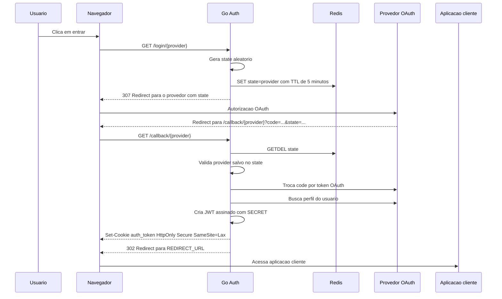

# Go Auth

Servidor Go simples para autenticação OAuth 2.0 com Google e GitHub. Ele inicia o login no provedor, valida o callback com `state` armazenado no Redis, busca dados básicos do usuário e entrega um JWT em cookie `HttpOnly`.

Simple Go OAuth 2.0 server for Google and GitHub. It starts provider login, validates the callback with a Redis-backed `state`, fetches basic user data, and returns a JWT in an `HttpOnly` cookie.

## Portugues

### Visao Geral

Rotas principais:

| Metodo | Rota | Descricao |
| --- | --- | --- |
| `GET` | `/home` | Pagina auxiliar com botoes de login. |
| `GET` | `/login/google` | Inicia login com Google. |
| `GET` | `/login/github` | Inicia login com GitHub. |
| `GET` | `/callback/google` | Callback OAuth do Google. |
| `GET` | `/callback/github` | Callback OAuth do GitHub. |
| `GET` | `/hc` | Healthcheck. |
| `GET` | `/static/*` | Arquivos estaticos de `internal/pages`. |

Depois do callback, o servidor:

1. Valida o `state` recebido usando Redis.
2. Troca o `code` OAuth com o provedor.
3. Busca o perfil do usuario.
4. Cria um JWT assinado com `SECRET`.
5. Define o cookie `auth_token` com `HttpOnly`, `Secure` e `SameSite=Lax`.
6. Redireciona o navegador para `REDIRECT_URL`.

O JWT nao e enviado na query string.

### Provedores

| Provedor | Uso | Habilitacao | Callback OAuth |
| --- | --- | --- | --- |
| Google | Login com conta Google usando OpenID Connect `userinfo`. | `GOOGLE_ENABLE=1` | `/callback/google` |
| GitHub | Login com conta GitHub usando a API `/user`. | `GITHUB_ENABLE=1` | `/callback/github` |
| Mock | Implementacao interna para testes automatizados. | Usado nos testes | Nao usa provedor externo |

Observacoes:

- Pelo menos um provedor real precisa estar habilitado.
- Rotas de provedor desabilitado retornam `404`.
- O GitHub pode retornar `email` vazio quando o e-mail do usuario nao e publico. Para e-mail privado/verificado, o projeto precisa solicitar `user:email` e consultar `/user/emails`.

### Requisitos

- Go `1.25.0`, conforme [go.mod](go.mod).
- Redis acessivel pelo backend.
- Aplicacao OAuth configurada no Google, GitHub ou ambos.
- Aplicacao cliente apontada por `REDIRECT_URL`.

### Variaveis de Ambiente

O projeto usa `github.com/joho/godotenv/autoload`, entao um arquivo `.env` na raiz e carregado automaticamente em desenvolvimento local.

Variaveis gerais:

| Variavel | Obrigatoria | Exemplo | Descricao |
| --- | --- | --- | --- |
| `PORT` | Sim | `8080` | Porta HTTP do servidor. |
| `REDIRECT_URL` | Sim | `https://app.exemplo.com/auth/callback` | URL final para onde o navegador e redirecionado apos login. |
| `SECRET` | Sim | `chave-aleatoria-com-32-bytes-ou-mais` | Chave usada para assinar JWT com HS256. |
| `REDIS_ADDR` | Sim | `localhost:6379` | Endereco do Redis usado para armazenar `state` OAuth. |
| `GOOGLE_ENABLE` | Sim | `1` ou `0` | Habilita Google. |
| `GITHUB_ENABLE` | Sim | `1` ou `0` | Habilita GitHub. |

Variaveis do Google, obrigatorias quando `GOOGLE_ENABLE=1`:

| Variavel | Exemplo | Descricao |
| --- | --- | --- |
| `GOOGLE_CLIENT_ID` | `1234567890-abc.apps.googleusercontent.com` | Client ID OAuth do Google. |
| `GOOGLE_CLIENT_SECRET` | `GOCSPX-...` | Client Secret OAuth do Google. |
| `GOOGLE_CALLBACK` | `http://localhost:8080/callback/google` | URI autorizada no Google Cloud Console. |

Variaveis do GitHub, obrigatorias quando `GITHUB_ENABLE=1`:

| Variavel | Exemplo | Descricao |
| --- | --- | --- |
| `GITHUB_CLIENT_ID` | `Ov23li...` | Client ID da GitHub OAuth App. |
| `GITHUB_CLIENT_SECRET` | `github-secret...` | Client Secret da GitHub OAuth App. |
| `GITHUB_CALLBACK` | `http://localhost:8080/callback/github` | Authorization callback URL configurada no GitHub. |

Exemplo com os dois provedores:

```env
PORT=8080
REDIRECT_URL=http://localhost:3000/auth/callback
SECRET=troque-por-uma-chave-aleatoria-com-32-bytes-ou-mais
REDIS_ADDR=localhost:6379

GOOGLE_ENABLE=1
GOOGLE_CLIENT_ID=seu-google-client-id.apps.googleusercontent.com
GOOGLE_CLIENT_SECRET=seu-google-client-secret
GOOGLE_CALLBACK=http://localhost:8080/callback/google

GITHUB_ENABLE=1
GITHUB_CLIENT_ID=seu-github-client-id
GITHUB_CLIENT_SECRET=seu-github-client-secret
GITHUB_CALLBACK=http://localhost:8080/callback/github
```

Mantenha `.env`, arquivos de credenciais e qualquer secret fora do versionamento.

### Redis e State OAuth

No `/login/{provider}`, o servidor gera um `state` aleatorio e salva no Redis:

```text
key:   <state>
value: GOOGLE ou GITHUB
ttl:   5 minutos
```

Esse mesmo `state` e enviado ao provedor OAuth. No `/callback/{provider}`, o servidor faz `GETDEL` no Redis:

- se o `state` nao existir, retorna `400`;
- se o provider salvo nao bater com a rota do callback, retorna `400`;
- se o `state` for valido, ele e consumido e nao pode ser reutilizado.

O `code` OAuth nao e validado pelo Redis. Ele e validado pelo provedor durante `conf.Exchange(ctx, code)`.

### Fluxo de Autenticacao



### Cookie e JWT

O cookie gerado no callback:

```text
auth_token=<jwt>; HttpOnly; Secure; SameSite=Lax; Path=/
```

O token e assinado com `HS256` usando `SECRET` e expira em 1 minuto. Claims atuais:

```json
{
  "name": "Nome do usuario",
  "email": "usuario@example.com",
  "location": "pt-BR",
  "picture": "https://...",
  "exp": 1710000000,
  "iat": 1709999940
}
```

### Como Executar

Suba o Redis local:

```bash
docker compose up -d redis
```

Instale dependencias e inicie o servidor:

```bash
go mod download
go run ./cmd
```

Com `PORT=8080`, acesse:

```text
http://localhost:8080/home
```

Ou inicie diretamente:

```text
http://localhost:8080/login/google
http://localhost:8080/login/github
```

### Testes

Execute:

```bash
make test
```

O alvo `make test` sobe `redis-test` via Docker Compose e executa `go test ./...` com `REDIS_ADDR=localhost:6380`.

### Melhorias Recomendadas

- Exigir tamanho minimo/entropia para `SECRET`, por exemplo 32 bytes aleatorios.
- Configurar senha/TLS no Redis em ambientes fora de desenvolvimento local.
- Usar `http.Server` com `ReadHeaderTimeout`, `ReadTimeout`, `WriteTimeout` e `IdleTimeout`.
- Definir `MaxAge`/`Expires` no cookie `auth_token` alinhado ao `exp` do JWT.
- Validar `email_verified` no Google quando e-mail for usado para autorizacao.
- No GitHub, solicitar `user:email` e buscar `/user/emails` quando precisar de e-mail verificado.
- Adicionar testes de integracao com servidores HTTP fake para Google e GitHub.
- Corrigir o module path `gitbhub.com/...` se a intencao for publicar/importar como `github.com/...`.

## English

### Overview

Main routes:

| Method | Route | Description |
| --- | --- | --- |
| `GET` | `/home` | Helper page with login buttons. |
| `GET` | `/login/google` | Starts Google login. |
| `GET` | `/login/github` | Starts GitHub login. |
| `GET` | `/callback/google` | Google OAuth callback. |
| `GET` | `/callback/github` | GitHub OAuth callback. |
| `GET` | `/hc` | Healthcheck. |
| `GET` | `/static/*` | Static files from `internal/pages`. |

After the provider callback, the server:

1. Validates the returned `state` using Redis.
2. Exchanges the OAuth `code` with the provider.
3. Fetches the user profile.
4. Creates a JWT signed with `SECRET`.
5. Sets the `auth_token` cookie with `HttpOnly`, `Secure`, and `SameSite=Lax`.
6. Redirects the browser to `REDIRECT_URL`.

The JWT is not sent in the query string.

### Environment Variables

General variables:

| Variable | Required | Example | Description |
| --- | --- | --- | --- |
| `PORT` | Yes | `8080` | HTTP server port. |
| `REDIRECT_URL` | Yes | `https://app.example.com/auth/callback` | Final URL after successful login. |
| `SECRET` | Yes | `random-key-with-at-least-32-bytes` | HS256 JWT signing key. |
| `REDIS_ADDR` | Yes | `localhost:6379` | Redis address used for OAuth `state`. |
| `GOOGLE_ENABLE` | Yes | `1` or `0` | Enables Google. |
| `GITHUB_ENABLE` | Yes | `1` or `0` | Enables GitHub. |

Google variables when `GOOGLE_ENABLE=1`:

| Variable | Example | Description |
| --- | --- | --- |
| `GOOGLE_CLIENT_ID` | `1234567890-abc.apps.googleusercontent.com` | Google OAuth Client ID. |
| `GOOGLE_CLIENT_SECRET` | `GOCSPX-...` | Google OAuth Client Secret. |
| `GOOGLE_CALLBACK` | `http://localhost:8080/callback/google` | Authorized redirect URI. |

GitHub variables when `GITHUB_ENABLE=1`:

| Variable | Example | Description |
| --- | --- | --- |
| `GITHUB_CLIENT_ID` | `Ov23li...` | GitHub OAuth App Client ID. |
| `GITHUB_CLIENT_SECRET` | `github-secret...` | GitHub OAuth App Client Secret. |
| `GITHUB_CALLBACK` | `http://localhost:8080/callback/github` | GitHub authorization callback URL. |

Example:

```env
PORT=8080
REDIRECT_URL=http://localhost:3000/auth/callback
SECRET=replace-with-a-random-key-with-at-least-32-bytes
REDIS_ADDR=localhost:6379

GOOGLE_ENABLE=1
GOOGLE_CLIENT_ID=your-google-client-id.apps.googleusercontent.com
GOOGLE_CLIENT_SECRET=your-google-client-secret
GOOGLE_CALLBACK=http://localhost:8080/callback/google

GITHUB_ENABLE=1
GITHUB_CLIENT_ID=your-github-client-id
GITHUB_CLIENT_SECRET=your-github-client-secret
GITHUB_CALLBACK=http://localhost:8080/callback/github
```

Keep `.env`, credential files, and all secrets out of version control.

### OAuth State

On `/login/{provider}`, the server generates a random `state` and stores it in Redis:

```text
key:   <state>
value: GOOGLE or GITHUB
ttl:   5 minutes
```

On `/callback/{provider}`, the server consumes the value with `GETDEL`, validates the stored provider, and rejects missing, expired, reused, or cross-provider states.

The OAuth `code` is validated by the provider during `conf.Exchange(ctx, code)`, not by Redis.

### Running

Start Redis:

```bash
docker compose up -d redis
```

Install dependencies and run:

```bash
go mod download
go run ./cmd
```

### Tests

Run:

```bash
make test
```

`make test` starts `redis-test` with Docker Compose and runs `go test ./...` using `REDIS_ADDR=localhost:6380`.

### Recommended Improvements

- Enforce minimum length/entropy for `SECRET`.
- Configure Redis password/TLS outside local development.
- Use `http.Server` timeouts.
- Set explicit `MaxAge`/`Expires` on the `auth_token` cookie.
- Validate Google `email_verified` when email is used for authorization.
- For GitHub, request `user:email` and fetch verified email addresses.
- Add integration tests with fake HTTP servers for Google and GitHub.
- Fix the module path `gitbhub.com/...` if it should be `github.com/...`.
