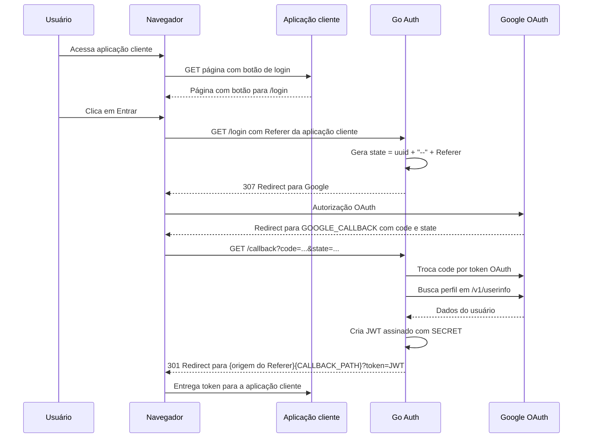
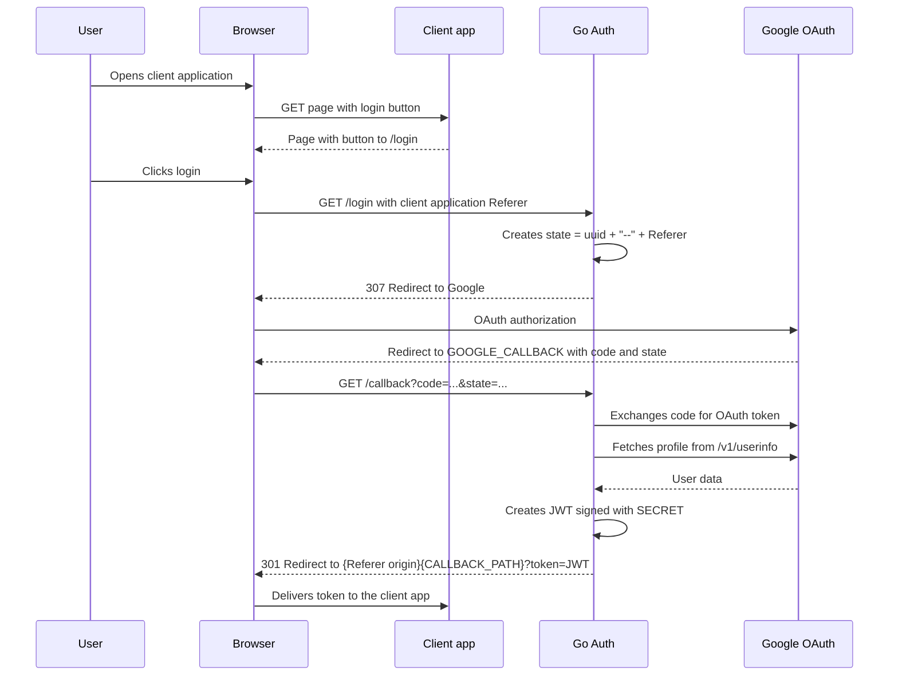

# Go Auth

Servidor Go simples para autenticação OAuth 2.0 com Google. A rota principal do fluxo é `/login`: ela redireciona o usuário para o Google, recebe o callback em `/callback`, busca os dados do perfil no endpoint OpenID Connect `userinfo` e devolve um JWT assinado para uma rota de callback da aplicação cliente. A rota `/home` existe apenas como página auxiliar de testes, com um botão apontando para `/login`.

Simple Go server for Google OAuth 2.0 authentication. The main flow route is `/login`: it redirects the user to Google, receives the callback on `/callback`, fetches profile data from the OpenID Connect `userinfo` endpoint, and returns a signed JWT to the client application's callback route. The `/home` route exists only as a helper test page with a button pointing to `/login`.

## Português

### Requisitos

- Go `1.25.0`, conforme definido em [go.mod](go.mod).
- Credenciais OAuth 2.0 do Google do tipo Web Application.
- Uma URI de redirect autorizada no Google Cloud Console apontando para a rota `/callback` deste servidor.

### Estrutura

```text
cmd/main.go                  # Inicializa servidor HTTP
internal/google/config.go    # Fluxo OAuth Google e criação do JWT
internal/routes/routes.go    # Rotas HTTP da aplicação
internal/pages/index.html    # Página auxiliar de teste com botão para /login
internal/pages/styles.css    # Estilos da página
```

### Variáveis de ambiente necessárias

A aplicação usa `github.com/joho/godotenv/autoload`, então um arquivo `.env` na raiz é carregado automaticamente em ambiente local.

| Variável | Obrigatória | Exemplo | Descrição |
| --- | --- | --- | --- |
| `PORT` | Sim | `5000` | Porta em que o servidor HTTP será iniciado. |
| `CLIENT_ID` | Sim | `1234567890-abc.apps.googleusercontent.com` | Client ID OAuth 2.0 do Google. |
| `CLIENT_SECRET` | Sim | `GOCSPX-...` | Client Secret OAuth 2.0 do Google. |
| `GOOGLE_CALLBACK` | Sim | `http://localhost:5000/callback` | URI cadastrada no Google para receber o callback OAuth. |
| `CALLBACK_PATH` | Sim | `/auth/callback` | Caminho da aplicação cliente para onde o servidor redireciona após gerar o JWT. |
| `SECRET` | Sim | `use-uma-chave-forte` | Chave usada para assinar o JWT com HS256. |

O `.env` local pode conter outras chaves vindas do arquivo de credenciais do Google, como `PROJECT_ID`, `AUTH_URI`, `TOKEN_URI` e `AUTH_PROVIDER_X509_CERT_URL`, mas o código atual não lê essas variáveis diretamente.

Exemplo de `.env`:

```env
PORT=5000
CLIENT_ID=seu-client-id.apps.googleusercontent.com
CLIENT_SECRET=seu-client-secret
GOOGLE_CALLBACK=http://localhost:5000/callback
CALLBACK_PATH=/auth/callback
SECRET=troque-por-uma-chave-secreta-forte
```

O `.gitignore` atual lista `.env`, `go.sum`, `google_credentials.json` e `coverage.out`. Mantenha pelo menos os arquivos com segredos fora do versionamento.

### Configuração no Google Cloud

1. Acesse o Google Cloud Console.
2. Configure a OAuth consent screen.
3. Crie credenciais OAuth do tipo Web Application.
4. Adicione a URI autorizada de redirecionamento com o mesmo valor de `GOOGLE_CALLBACK`.

Exemplo para desenvolvimento local:

```text
http://localhost:5000/callback
```

Os escopos solicitados pelo código são:

```text
email
profile
```

### Como executar

Instale as dependências:

```bash
go mod download
```

Inicie o servidor:

```bash
go run ./cmd
```

Com `PORT=5000`, a rota principal exposta pelo servidor é:

```text
http://localhost:5000/login
```

Essa rota deve ser acessada por um link ou botão em uma página da aplicação cliente, para que o navegador envie um header `Referer`.

Para um teste manual simples, acesse a página auxiliar:

```text
http://localhost:5000/home
```

### Rotas

| Método | Rota | Descrição |
| --- | --- | --- |
| `GET` | `/home` | Página auxiliar usada para testes manuais. Renderiza um botão que aponta para `/login`. |
| `GET` | `/login` | Rota principal. Cria a URL OAuth e redireciona o usuário para o Google. |
| `GET` | `/callback` | Recebe `code` e `state` do Google, cria o JWT e redireciona para `CALLBACK_PATH`. |
| `GET` | `/hc` | Healthcheck. Retorna JSON com `"Im breathing"`. |
| `GET` | `/static/*` | Serve arquivos estáticos de `internal/pages`. |

### Fluxo de autenticação



Observação: o código usa o header `Referer` recebido em `/login` para descobrir a origem de retorno. Em uma integração real, o usuário deve sair de uma página da aplicação cliente para `/login`, para que o navegador envie um `Referer` válido. A rota `/home` é apenas um cliente mínimo para testes manuais desse redirecionamento.

### JWT gerado

O token é assinado com `HS256` usando `SECRET` e expira em 1 minuto. As claims atuais incluem:

```json
{
  "sub": "google-user-id",
  "name": "Nome do usuário",
  "email": "usuario@example.com",
  "local": "pt-BR",
  "emailVerfied": true,
  "picture": "https://...",
  "exp": 1710000000,
  "iat": 1709999940
}
```

### Exemplos

Healthcheck:

```bash
curl http://localhost:5000/hc
```

Resposta:

```json
"Im breathing"
```

Iniciar login via `curl`, simulando o `Referer` da aplicação cliente:

```bash
curl -i \
  -H "Referer: http://localhost:3000/login" \
  http://localhost:5000/login
```

O retorno esperado é um redirect `307 Temporary Redirect` para uma URL do Google.

Após o callback, para uma aplicação cliente em `http://localhost:3000` com `CALLBACK_PATH=/auth/callback`, o redirect final será:

```text
http://localhost:3000/auth/callback?token=<jwt>
```

Para testar usando a página auxiliar `/home`, configure `CALLBACK_PATH=/home` e acesse `http://localhost:5000/home`.

### Testes

Execute:

```bash
go test ./...
```

Os testes atuais cobrem as rotas `/hc`, `/home`, `/login` e `/callback` usando um mock da integração com Google.

## English

### Requirements

- Go `1.25.0`, as defined in [go.mod](go.mod).
- Google OAuth 2.0 credentials for a Web Application.
- An authorized redirect URI in Google Cloud Console pointing to this server's `/callback` route.

### Structure

```text
cmd/main.go                  # Starts the HTTP server
internal/google/config.go    # Google OAuth flow and JWT creation
internal/routes/routes.go    # Application HTTP routes
internal/pages/index.html    # Helper test page with a button to /login
internal/pages/styles.css    # Page styles
```

### Required Environment Variables

The app uses `github.com/joho/godotenv/autoload`, so a root `.env` file is loaded automatically in local development.

| Variable | Required | Example | Description |
| --- | --- | --- | --- |
| `PORT` | Yes | `5000` | Port used by the HTTP server. |
| `CLIENT_ID` | Yes | `1234567890-abc.apps.googleusercontent.com` | Google OAuth 2.0 Client ID. |
| `CLIENT_SECRET` | Yes | `GOCSPX-...` | Google OAuth 2.0 Client Secret. |
| `GOOGLE_CALLBACK` | Yes | `http://localhost:5000/callback` | URI registered in Google to receive the OAuth callback. |
| `CALLBACK_PATH` | Yes | `/auth/callback` | Client application path the server redirects to after creating the JWT. |
| `SECRET` | Yes | `use-a-strong-key` | Key used to sign the JWT with HS256. |

Your local `.env` may contain other keys from Google's downloaded credentials, such as `PROJECT_ID`, `AUTH_URI`, `TOKEN_URI`, and `AUTH_PROVIDER_X509_CERT_URL`, but the current code does not read them directly.

Example `.env`:

```env
PORT=5000
CLIENT_ID=your-client-id.apps.googleusercontent.com
CLIENT_SECRET=your-client-secret
GOOGLE_CALLBACK=http://localhost:5000/callback
CALLBACK_PATH=/auth/callback
SECRET=replace-with-a-strong-secret-key
```

The current `.gitignore` lists `.env`, `go.sum`, `google_credentials.json`, and `coverage.out`. Keep at least the files containing secrets out of version control.

### Google Cloud Setup

1. Open Google Cloud Console.
2. Configure the OAuth consent screen.
3. Create OAuth credentials for a Web Application.
4. Add an authorized redirect URI with the same value as `GOOGLE_CALLBACK`.

Local development example:

```text
http://localhost:5000/callback
```

The code requests these scopes:

```text
email
profile
```

### Running the App

Install dependencies:

```bash
go mod download
```

Start the server:

```bash
go run ./cmd
```

With `PORT=5000`, the main route exposed by the server is:

```text
http://localhost:5000/login
```

This route should be opened through a link or button in a client application page, so the browser sends a `Referer` header.

For a simple manual test, open the helper page:

```text
http://localhost:5000/home
```

### Routes

| Method | Route | Description |
| --- | --- | --- |
| `GET` | `/home` | Helper page used for manual tests. Renders a button pointing to `/login`. |
| `GET` | `/login` | Main route. Creates the OAuth URL and redirects the user to Google. |
| `GET` | `/callback` | Receives `code` and `state` from Google, creates the JWT, and redirects to `CALLBACK_PATH`. |
| `GET` | `/hc` | Healthcheck. Returns JSON with `"Im breathing"`. |
| `GET` | `/static/*` | Serves static files from `internal/pages`. |

### Authentication Flow



Note: the code uses the `Referer` header received by `/login` to discover the return origin. In a real integration, the user should leave a client application page for `/login`, so the browser sends a valid `Referer`. The `/home` route is only a minimal client for manually testing that redirect.

### Generated JWT

The token is signed with `HS256` using `SECRET` and expires in 1 minute. The current claims include:

```json
{
  "sub": "google-user-id",
  "name": "User name",
  "email": "user@example.com",
  "local": "en-US",
  "emailVerfied": true,
  "picture": "https://...",
  "exp": 1710000000,
  "iat": 1709999940
}
```

### Examples

Healthcheck:

```bash
curl http://localhost:5000/hc
```

Response:

```json
"Im breathing"
```

Start login with `curl`, simulating the client application's `Referer`:

```bash
curl -i \
  -H "Referer: http://localhost:3000/login" \
  http://localhost:5000/login
```

The expected response is a `307 Temporary Redirect` to a Google URL.

After the callback, for a client application at `http://localhost:3000` with `CALLBACK_PATH=/auth/callback`, the final redirect will be:

```text
http://localhost:3000/auth/callback?token=<jwt>
```

To test with the `/home` helper page, set `CALLBACK_PATH=/home` and open `http://localhost:5000/home`.

### Tests

Run:

```bash
go test ./...
```

The current tests cover `/hc`, `/home`, `/login`, and `/callback` using a mock for the Google integration.
